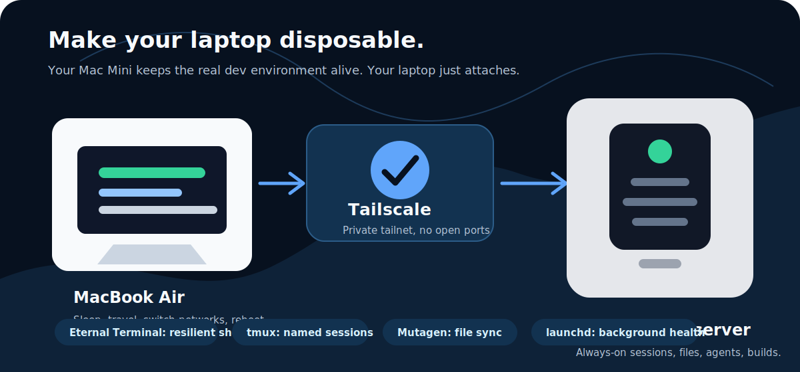
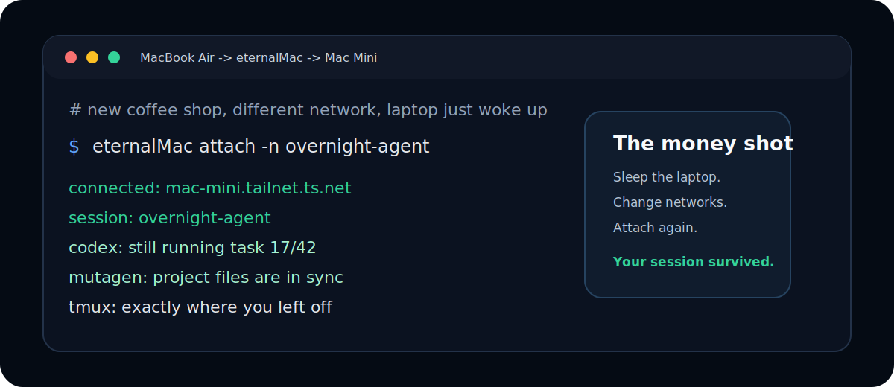

# eternalMac

Make your laptop disposable.

`eternalMac` turns a Mac Mini into an always-on devserver your laptop just attaches to. Sleep the laptop, change networks, reboot, or move to another machine; your real dev session keeps running on the Mac Mini.

[](https://github.com/eternalMac/eternalMac/actions/workflows/rust.yml)
[](https://github.com/eternalMac/eternalMac/releases)
[](./LICENSE)
[](https://eternalmac.dev/docs)





## Why

Modern development sessions are long-running. Agents keep working overnight, builds take time, and context lives in terminals. A laptop is the worst place for that state: it sleeps, disconnects, gets moved, and runs out of battery.

`eternalMac` makes the Mac Mini the stable machine and the laptop the thin client.

- Keep Claude/Codex/OpenCode-style agent sessions running on the Mac Mini.
- Reconnect to named remote `tmux` sessions with `eternalMac attach`.
- Sync project files continuously with Mutagen.
- Reach the Mac Mini privately through Tailscale, without opening public ports.

Under the hood, `eternalMac` wires together Eternal Terminal, `tmux`, Mutagen, Tailscale, and `launchd` behind one CLI.

## Install

Install from the eternalMac Homebrew tap:

```bash
brew install eternalmac/eternalmac/eternalmac
```

No separate `brew tap` is required for that fully qualified install command. If you prefer the shorter command later:

```bash
brew tap eternalmac/eternalmac
brew install eternalmac
```

## Quick Start

On the Mac Mini:

```bash
eternalMac setup server
```

On the laptop:

```bash
eternalMac setup client --server <tailscale-dns-name>
```

Attach to the default remote session:

```bash
eternalMac attach
```

Create a named remote session and attach immediately:

```bash
eternalMac attach -n overnight-agent
```

Full setup and troubleshooting docs:

https://eternalmac.dev/docs

## What It Gives You

### Resilient Remote Sessions

`eternalMac attach` connects through Eternal Terminal into a named `tmux` session on the Mac Mini. If the laptop sleeps or changes networks, reconnect to the same session.

### File Sync

Project sync uses Mutagen:

```bash
eternalMac sync add project --local ~/project --remote ~/project
```

If a specific project needs exclusions, pass Mutagen ignore patterns:

```bash
eternalMac sync add project \
  --local ~/project \
  --remote ~/project \
  --ignore .env \
  --ignore "secrets/"
```

### DotSync

During `eternalMac setup client`, you can optionally enable DotSync. DotSync detects supported AI-agent dotfiles such as Claude Code, Codex, OpenCode, Goose, Gemini CLI, Qwen Code, Pi, and Amp, then creates normal EternalMac sync roots for the targets you approve.

DotSync is off by default. It uses a curated allowlist instead of syncing every hidden file in your home directory, and it excludes common auth, cache, log, telemetry, and machine-identity files.

### Health Checks

```bash
eternalMac status
eternalMac doctor
```

`doctor` exits non-zero when it finds issues, making it usable for smoke checks and automation gates.

## Requirements

- Apple Silicon Mac Mini as the server
- Apple Silicon macOS laptop as the client
- Homebrew
- Tailscale account and both machines in the same tailnet
- macOS Remote Login enabled on the Mac Mini

The published Homebrew formula is currently Apple Silicon only. Intel Mac support is not promised yet.

## Commands

```bash
eternalMac setup server
eternalMac setup client [--server <dns-name>]

eternalMac attach [session]
eternalMac attach -n <session>

eternalMac session list
eternalMac session new <name>
eternalMac session pin <name>
eternalMac session unpin <name>

eternalMac sync add <name> --local <path> --remote <path> [--ignore <pattern> ...]
eternalMac sync list
eternalMac sync status

eternalMac status
eternalMac doctor
```

## FAQ

### Why not just SSH into tmux?

You can. `eternalMac` is for the setup you would otherwise keep rebuilding by hand: resilient shell transport, named sessions, file sync, private reachability, launchd agents, status, and doctor checks.

### Why Tailscale?

The Mac Mini should be reachable from anywhere without opening public SSH ports. Tailscale gives `eternalMac` a private network path and stable DNS name.

### Does project sync exclude secrets by default?

No. Normal project sync is user-directed full-tree sync. If you ask to sync a project, `eternalMac` syncs that project. Use `--ignore` for project-specific exclusions. DotSync is different: it is curated and excludes common auth/cache/machine-state files by default.

### Does this replace cloud dev environments?

No. It is a personal devserver workflow for people who already have a Mac Mini and want their own hardware to be the always-on machine.

## Development

Build:

```bash
cargo build
```

Run tests:

```bash
cargo test
```

Run the smoke check:

```bash
bash scripts/smoke/bootstrap.sh
```

Check repository hygiene:

```bash
bash scripts/check-no-tracked-ignored.sh
```

## Packaging

The repo includes Homebrew packaging support under `packaging/homebrew`. Local release packaging can be validated with:

```bash
scripts/release/package-homebrew.sh
scripts/release/install-homebrew-local.sh
```

## Contributing

See [CONTRIBUTING.md](./CONTRIBUTING.md).

## License

eternalMac is licensed under the Apache License, Version 2.0. See [LICENSE](./LICENSE) and [NOTICE](./NOTICE).
